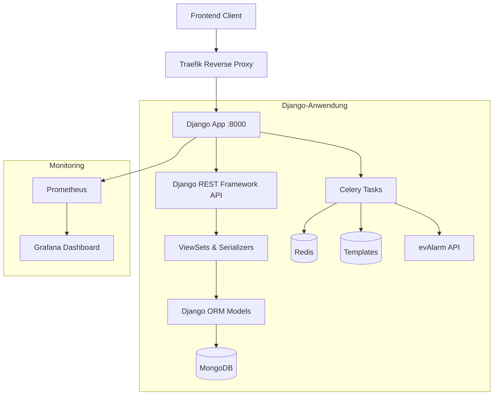

# Entwicklerdokumentation: evAlarm-IoT Gateway Management System (Django-Version)

Diese Dokumentation richtet sich an Entwickler, die am evAlarm-IoT Gateway Management System mit Django und Django REST Framework arbeiten. Sie enthält Informationen zur Architektur, Codestandards, Best Practices und Migrationsrichtlinien.

## Inhaltsverzeichnis

1. [Systemarchitektur](#systemarchitektur)
2. [Codeorganisation](#codeorganisation)
3. [Entwicklungsumgebung](#entwicklungsumgebung)
4. [API-Design-Prinzipien](#api-design-prinzipien)
5. [Best Practices](#best-practices)
6. [Migrations-Guidelines](#migrations-guidelines)
7. [Debugging und Troubleshooting](#debugging-und-troubleshooting)
8. [Deployment](#deployment)
9. [Observability](#observability)
10. [Security](#security)

## Systemarchitektur

Das evAlarm-IoT Gateway Management System wird als Django-Monolith mit Celery-Workern für asynchrone Verarbeitung implementiert:

### Architekturdiagramm



### Hauptkomponenten

1. **Django-Anwendung (roombanker, Port 8000)**
   - Einziger Einstiegspunkt für alle API-Anfragen
   - Implementiert mit Django 5.0 und Django REST Framework
   - Integriert alle bisherigen Services in Django-Apps

2. **Django REST Framework API**
   - Implementiert die RESTful API
   - ViewSets und Serializer für alle Ressourcen
   - API-Versionierung und konsistentes Response-Format
   - Automatische OpenAPI-Dokumentation

3. **Django-Admin**
   - Administrative Oberfläche für Kunden, Gateways, Templates
   - Benutzerverwaltung und Berechtigungskonfiguration
   - Erweiterte Filter- und Suchfunktionen

4. **Celery Worker**
   - Asynchrone Verarbeitung aller Nachrichten
   - Implementierung des Message-Forwarders
   - Retry-Mechanismus und Circuit Breaker für Ausfallsicherheit
   - Geplante Tasks für Wartungs- und Überwachungsaufgaben

### Datenbanken

1. **MongoDB**
   - Speichert persistente Daten (Kunden, Gateways, Geräte)
   - Zugegriffen über Django-ORM mit mongoengine oder djongo

2. **Redis**
   - Dient als Message Broker für Celery
   - Speichert Celery-Ergebnisse und -Status
   - Cache für häufig abgefragte Daten

### Vorteile gegenüber der vorherigen Architektur

1. **Vereinfachte Infrastruktur**
   - Ein einziger Service statt mehrerer Flask-Services
   - Vereinfachtes Routing durch zentralen URL-Dispatcher
   - Kein separater Message Processor/Worker mehr nötig

2. **Konsistente Fehlerbehandlung**
   - Globale Exception-Handler durch Django-Middleware
   - Einheitliches Response-Format durch Custom Renderer

3. **Verbesserte Modularität**
   - Modulare Django-Apps statt separater Services
   - Klare Schnittstellen durch Django's App-Konzept
   - Keine zirkulären Abhängigkeiten mehr

4. **Robuste Grundlage**
   - Ausgereiftes Django-ORM für Datenoperationen
   - Bewährtes Authentifizierungs- und Berechtigungssystem
   - Skalierbare Celery-Tasks für asynchrone Verarbeitung

## Codeorganisation

Die neue Codeorganisation folgt der standardisierten Django-Projektstruktur:

```
roombankerRestAPIWeb/
├── roombanker/                # Django-Hauptprojekt
│   ├── __init__.py
│   ├── asgi.py                # ASGI-Konfiguration
│   ├── celery.py              # Celery-Konfiguration
│   ├── settings/              # Einstellungsmodule
│   │   ├── __init__.py
│   │   ├── base.py            # Basis-Einstellungen
│   │   ├── development.py     # Entwicklungseinstellungen
│   │   └── production.py      # Produktionseinstellungen
│   ├── urls.py                # Haupt-URL-Konfiguration
│   └── wsgi.py                # WSGI-Konfiguration
├── apps/                      # Django-Anwendungen
│   ├── core/                  # Basiskomponenten
│   │   ├── __init__.py
│   │   ├── admin.py           # Admin-Konfiguration
│   │   ├── apps.py            # App-Konfiguration
│   │   ├── middleware.py      # Gemeinsame Middleware
│   │   ├── models.py          # Basismodelle
│   │   ├── serializers.py     # Basis-Serializers
│   │   ├── urls.py            # URL-Konfiguration
│   │   └── views.py           # Basis-Views
│   ├── customers/             # Kundenverwaltung
│   ├── gateways/              # Gateway-Verwaltung
│   ├── devices/               # Geräteverwaltung
│   ├── templates_engine/      # Template-Engine
│   ├── messages/              # Nachrichtenverarbeitung
│   └── health/                # Gesundheitschecks
├── api/                       # API-Versionsmodule
│   ├── __init__.py
│   ├── v1/                    # API v1
│   │   ├── __init__.py
│   │   ├── routers.py         # DRF Router Konfiguration
│   │   ├── schemas.py         # API-Schemas
│   │   └── urls.py            # API URL-Konfiguration
│   └── common/                # API-übergreifende Komponenten
│       ├── __init__.py
│       ├── exceptions.py      # Exceptions und Handler
│       ├── pagination.py      # Paginierungsklassen
│       ├── permissions.py     # Berechtigungsklassen
│       └── renderers.py       # Response-Renderer
├── frontend/                  # React-Frontend (unverändert)
├── templates/                 # Django HTML-Templates (für Admin)
├── static/                    # Statische Dateien
├── media/                     # Benutzergenerierte Dateien
├── tests/                     # Testmodule
│   ├── integration/           # Integrationstests
│   ├── unit/                  # Unit-Tests
│   └── e2e/                   # End-to-End-Tests
├── scripts/                   # Utility-Skripte
│   ├── migration/             # Datenmigrations-Skripte
│   └── deployment/            # Deployment-Skripte
├── docker/                    # Docker-Konfiguration
│   ├── Dockerfile             # Django App Dockerfile
│   ├── Dockerfile.celery      # Celery Worker Dockerfile
│   └── docker-compose.yml     # Docker Compose Konfiguration
├── docs/                      # Projektdokumentation
├── manage.py                  # Django-Verwaltungsskript
├── requirements/              # Python-Abhängigkeiten
│   ├── base.txt               # Basis-Abhängigkeiten
│   ├── development.txt        # Entwicklungsabhängigkeiten
│   └── production.txt         # Produktionsabhängigkeiten
├── .env.example               # Beispiel-Umgebungsvariablen
└── pyproject.toml             # Python-Projektkonfiguration
```

## Entwicklungsumgebung

### Anforderungen

- Python 3.11+
- Node.js 20+ (für Frontend)
- Docker und Docker Compose
- MongoDB 5.0+
- Redis 6.0+

### Setup mit Docker Compose

Die empfohlene Methode zur Einrichtung der Entwicklungsumgebung ist Docker Compose:

```bash
# Repository klonen
git clone https://github.com/nextX-AG/roombankerRestAPIWeb.git
cd roombankerRestAPIWeb

# Umgebungsvariablen konfigurieren
cp .env.example .env
# .env-Datei anpassen

# Docker-Container starten
docker-compose up
```

Dies startet alle benötigten Dienste:
- Django-Anwendung (mit Live Reload)
- Celery Worker
- MongoDB
- Redis
- Traefik als Reverse Proxy
- Prometheus und Grafana für Monitoring

### Lokales Setup (alternativ)

1. **Virtuelle Umgebung einrichten**

   ```bash
   python -m venv venv
   source venv/bin/activate  # Unter Windows: venv\Scripts\activate
   pip install -r requirements/development.txt
   ```

2. **Frontend-Abhängigkeiten installieren**

   ```bash
   cd frontend
   npm install
   npm start  # Frontend-Entwicklungsserver starten
   cd ..
   ```

3. **Datenbanken starten**

   ```bash
   # MongoDB und Redis müssen lokal installiert und gestartet sein
   # Alternativ können Docker-Container verwendet werden:
   docker-compose up -d mongodb redis
   ```

4. **Django-Anwendung starten**

   ```bash
   python manage.py migrate  # Datenbank-Migrationen anwenden
   python manage.py runserver  # Entwicklungsserver starten
   ```

5. **Celery Worker starten**

   ```bash
   celery -A roombanker worker -l info
   ```

## API-Design-Prinzipien

### API-Versionierung

Die API wird mit Django REST Framework versioniert:

```python
# roombanker/urls.py
urlpatterns = [
    path('admin/', admin.site.urls),
    path('api/v1/', include('api.v1.urls')),
    # Weitere URL-Patterns
]
```

Versionierungsstrategie:
1. URL-basierte Versionierung (`/api/v1/`, `/api/v2/`)
2. Jede Version hat eigene Router, Views und Serializer
3. Strikte Abwärtskompatibilität innerhalb einer Version

### Einheitliches Response-Format

Alle API-Responses verwenden dasselbe Format:

```python
# api/common/renderers.py
class UnifiedJSONRenderer(renderers.JSONRenderer):
    def render(self, data, accepted_media_type=None, renderer_context=None):
        response_data = {
            'status': 'success',
            'data': data,
            'error': None
        }
        
        # Fehlerbehandlung
        if renderer_context and 'response' in renderer_context:
            response = renderer_context['response']
            if response.status_code >= 400:
                response_data['status'] = 'error'
                response_data['data'] = None
                response_data['error'] = data
        
        return super().render(response_data, accepted_media_type, renderer_context)
```

Beispiel-Response bei Erfolg:
```json
{
  "status": "success",
  "data": {
    "id": "123",
    "name": "Gateway XYZ"
  },
  "error": null
}
```

Bei Fehlern:
```json
{
  "status": "error",
  "data": null,
  "error": {
    "code": "gateway_not_found",
    "message": "Gateway mit ID 123 wurde nicht gefunden",
    "details": {}
  }
}
```

### OpenAPI-Dokumentation

Die API-Dokumentation wird automatisch mit drf-spectacular generiert:

```python
# roombanker/settings/base.py
INSTALLED_APPS = [
    # ... andere Apps
    'drf_spectacular',
]

REST_FRAMEWORK = {
    # ... andere Einstellungen
    'DEFAULT_SCHEMA_CLASS': 'drf_spectacular.openapi.AutoSchema',
}

SPECTACULAR_SETTINGS = {
    'TITLE': 'evAlarm IoT Gateway API',
    'VERSION': '1.0.0',
    'SERVE_INCLUDE_SCHEMA': False,
}
```

```python
# roombanker/urls.py
from drf_spectacular.views import (
    SpectacularAPIView,
    SpectacularSwaggerView,
    SpectacularRedocView,
)

urlpatterns = [
    # ... andere URL-Patterns
    path('api/schema/', SpectacularAPIView.as_view(), name='schema'),
    path('api/docs/', SpectacularSwaggerView.as_view(url_name='schema'), name='swagger-ui'),
    path('api/redoc/', SpectacularRedocView.as_view(url_name='schema'), name='redoc'),
]
```

## Best Practices

### Django Models

1. **Abstrakte Basismodelle**

   ```python
   # apps/core/models.py
   class BaseModel(models.Model):
       created_at = models.DateTimeField(auto_now_add=True)
       updated_at = models.DateTimeField(auto_now=True)
       
       class Meta:
           abstract = True
   ```

2. **MongoDB-Integration mit Djongo**

   ```python
   # apps/devices/models.py
   from djongo import models
   from apps.core.models import BaseModel
   
   class Device(BaseModel):
       id = models.ObjectIdField(primary_key=True)
       gateway = models.ForeignKey('gateways.Gateway', on_delete=models.CASCADE)
       device_id = models.CharField(max_length=100)
       name = models.CharField(max_length=200)
       metadata = models.JSONField(default=dict)
       
       class Meta:
           indexes = [
               models.Index(fields=['gateway', 'device_id']),
           ]
   ```

3. **Validierung in Models**

   ```python
   # apps/gateways/models.py
   from django.core.validators import RegexValidator
   
   class Gateway(BaseModel):
       uuid = models.CharField(
           max_length=36,
           validators=[RegexValidator(
               regex=r'^[0-9a-f]{8}-[0-9a-f]{4}-[0-9a-f]{4}-[0-9a-f]{4}-[0-9a-f]{12}$',
               message='UUID muss im Format 8-4-4-4-12 sein'
           )]
       )
       # ... weitere Felder
   ```

### Django REST Framework

1. **ViewSets für CRUD-Operationen**

   ```python
   # apps/gateways/views.py
   from rest_framework import viewsets
   from .models import Gateway
   from .serializers import GatewaySerializer
   
   class GatewayViewSet(viewsets.ModelViewSet):
       queryset = Gateway.objects.all()
       serializer_class = GatewaySerializer
       filterset_fields = ['customer', 'status']
       search_fields = ['name', 'uuid']
   ```

2. **Serializer mit Validierung**

   ```python
   # apps/gateways/serializers.py
   from rest_framework import serializers
   from .models import Gateway
   
   class GatewaySerializer(serializers.ModelSerializer):
       class Meta:
           model = Gateway
           fields = ['id', 'uuid', 'name', 'customer', 'status', 'created_at']
           read_only_fields = ['id', 'created_at']
       
       def validate(self, data):
           # Benutzerdefinierte Validierung
           return data
   ```

3. **Permissions**

   ```python
   # api/common/permissions.py
   from rest_framework import permissions
   
   class IsCustomerOwner(permissions.BasePermission):
       """
       Erlaubt nur Zugriff auf Objekte, die dem Kunden des Benutzers gehören
       """
       def has_object_permission(self, request, view, obj):
           if request.user.is_staff:
               return True
           return obj.customer == request.user.customer
   ```

### Celery Tasks

1. **Task-Definition**

   ```python
   # apps/messages/tasks.py
   from roombanker.celery import app
   from celery import shared_task
   from .models import Message
   from ..templates_engine.models import Template
   
   @shared_task(
       bind=True,
       retry_backoff=True,
       max_retries=5,
       autoretry_for=(Exception,)
   )
   def process_message(self, message_id):
       message = Message.objects.get(id=message_id)
       template = Template.objects.get(id=message.template_id)
       
       # Nachrichtenverarbeitung
       try:
           transformed_data = transform_message(message.data, template)
           send_to_evalarm(transformed_data, message.customer)
           message.status = 'processed'
           message.save()
       except Exception as e:
           message.status = 'failed'
           message.error = str(e)
           message.save()
           raise  # Löst Retry aus
   ```

2. **Task-Aufruf in Views**

   ```python
   # apps/messages/views.py
   from rest_framework import status
   from rest_framework.response import Response
   from rest_framework.decorators import action
   from .tasks import process_message
   
   class MessageViewSet(viewsets.ModelViewSet):
       # ... ViewSet-Konfiguration
       
       def create(self, request, *args, **kwargs):
           serializer = self.get_serializer(data=request.data)
           serializer.is_valid(raise_exception=True)
           message = serializer.save()
           
           # Asynchrone Verarbeitung starten
           process_message.delay(message.id)
           
           return Response(serializer.data, status=status.HTTP_201_CREATED)
   ```

### Logging

```python
# roombanker/settings/base.py
LOGGING = {
    'version': 1,
    'disable_existing_loggers': False,
    'formatters': {
        'json': {
            '()': 'pythonjsonlogger.jsonlogger.JsonFormatter',
            'format': '%(asctime)s %(levelname)s %(name)s %(message)s',
        },
    },
    'handlers': {
        'console': {
            'class': 'logging.StreamHandler',
            'formatter': 'json',
        },
    },
    'loggers': {
        'django': {
            'handlers': ['console'],
            'level': 'INFO',
        },
        'roombanker': {
            'handlers': ['console'],
            'level': 'DEBUG',
            'propagate': False,
        },
    },
}
```

## Migrations-Guidelines

### Schritt 1: Django-Projekt einrichten

1. **Neue Projektstruktur erstellen**
   - Django-Projekt und Apps anlegen
   - Strukturen für Modelle, Views und Serializer definieren

2. **Docker-Setup aktualisieren**
   - Docker Compose für Django-Stack erstellen
   - Traefik-Konfiguration für Routing

### Schritt 2: Datenmodelle migrieren

1. **MongoDB-Modelle definieren**
   - Django-ORM-Modelle für vorhandene MongoDB-Daten
   - Beziehungen zwischen Modellen etablieren

2. **Data Migration Script erstellen**
   - Migriere Daten aus alter Struktur in neue Models
   - Format-Transformationen wo nötig

### Schritt 3: API-Endpunkte implementieren

1. **URL-Struktur definieren**
   - Versionierte API-Endpunkte (`/api/v1/`)
   - Kompatibilitätsschicht für bestehende Endpunkte

2. **ViewSets und Serializer erstellen**
   - ViewSets für alle Ressourcen
   - Serializer mit Validierungslogik

### Schritt 4: Nachrichtenverarbeitung migrieren

1. **Celery-Tasks für Nachrichtenverarbeitung definieren**
   - Implementiere Message Worker als Celery-Tasks
   - Circuit Breaker und Retry-Logik einbauen

2. **Template-Engine integrieren**
   - Portiere bestehende Template-Logik
   - Verbessere Template-Testen im Admin

### Schritt 5: Tests und Deployment

1. **Testabdeckung sicherstellen**
   - Unit-Tests für kritische Komponenten
   - Integrationstests für API-Endpunkte
   - End-to-End-Tests mit Frontend

2. **Deployment-Strategie umsetzen**
   - CI/CD-Pipeline für automatisierte Tests
   - Staging-Umgebung für finale Tests
   - Schrittweise Umstellung der Produktion

## Debugging und Troubleshooting

### Django Debug Tools

1. **Django Debug Toolbar**
   
   In `settings/development.py`:
   ```python
   INSTALLED_APPS += ['debug_toolbar']
   MIDDLEWARE += ['debug_toolbar.middleware.DebugToolbarMiddleware']
   INTERNAL_IPS = ['127.0.0.1']
   ```

2. **Celery Flower für Task-Monitoring**

   ```bash
   celery -A roombanker flower
   ```

3. **Django Admin Panel für Dateninspektion**

   Der Django Admin ist ein mächtiges Debugging-Tool:
   - Suche und Filter für alle Modelle
   - Beziehungen zwischen Objekten visualisieren
   - Schnelle Datenmanipulation zum Testen

### Logging und Monitoring

1. **Strukturiertes Logging mit Trace-IDs**

   ```python
   # api/common/middleware.py
   class TraceIDMiddleware:
       def __init__(self, get_response):
           self.get_response = get_response
           
       def __call__(self, request):
           trace_id = request.headers.get('X-Trace-ID', str(uuid.uuid4()))
           request.trace_id = trace_id
           
           # Füge Trace-ID zum Logger-Kontext hinzu
           logger = logging.getLogger('roombanker')
           logger = logger.bind(trace_id=trace_id)
           
           response = self.get_response(request)
           response['X-Trace-ID'] = trace_id
           return response
   ```

2. **Prometheus Monitoring**

   ```python
   # roombanker/settings/base.py
   INSTALLED_APPS += ['django_prometheus']
   MIDDLEWARE = ['django_prometheus.middleware.PrometheusBeforeMiddleware'] + MIDDLEWARE
   MIDDLEWARE += ['django_prometheus.middleware.PrometheusAfterMiddleware']
   ```

## Deployment

### Docker Deployment

1. **Produktions-Dockerfile**

   ```dockerfile
   # docker/Dockerfile
   FROM python:3.11-slim
   
   WORKDIR /app
   
   # Installiere Abhängigkeiten
   COPY requirements/production.txt /app/requirements.txt
   RUN pip install --no-cache-dir -r requirements.txt
   
   # Kopiere Projektdateien
   COPY . /app/
   
   # Sammle statische Dateien
   RUN python manage.py collectstatic --noinput
   
   # Starte Gunicorn
   CMD ["gunicorn", "--bind", "0.0.0.0:8000", "--workers", "4", "roombanker.wsgi:application"]
   ```

2. **Docker Compose für Produktion**

   ```yaml
   # docker-compose.production.yml
   version: '3.8'
   
   services:
     traefik:
       image: traefik:v2.7
       command:
         - "--providers.docker=true"
         - "--providers.docker.exposedbydefault=false"
         - "--entrypoints.web.address=:80"
         - "--entrypoints.websecure.address=:443"
       ports:
         - "80:80"
         - "443:443"
       volumes:
         - /var/run/docker.sock:/var/run/docker.sock
         - ./traefik/certificates:/certificates
     
     web:
       build:
         context: .
         dockerfile: docker/Dockerfile
       environment:
         - DJANGO_SETTINGS_MODULE=roombanker.settings.production
         - DATABASE_URL=mongodb://mongodb:27017/roombanker
         - REDIS_URL=redis://redis:6379/0
         - SECRET_KEY=${SECRET_KEY}
       depends_on:
         - mongodb
         - redis
       labels:
         - "traefik.enable=true"
         - "traefik.http.routers.web.rule=Host(`api.example.com`)"
         - "traefik.http.routers.web.entrypoints=websecure"
         - "traefik.http.routers.web.tls=true"
     
     celery:
       build:
         context: .
         dockerfile: docker/Dockerfile.celery
       environment:
         - DJANGO_SETTINGS_MODULE=roombanker.settings.production
         - DATABASE_URL=mongodb://mongodb:27017/roombanker
         - REDIS_URL=redis://redis:6379/0
         - SECRET_KEY=${SECRET_KEY}
       depends_on:
         - mongodb
         - redis
     
     mongodb:
       image: mongo:5.0
       volumes:
         - mongodb_data:/data/db
     
     redis:
       image: redis:6.0
       volumes:
         - redis_data:/data
     
     prometheus:
       image: prom/prometheus
       volumes:
         - ./prometheus:/etc/prometheus
         - prometheus_data:/prometheus
       labels:
         - "traefik.enable=true"
         - "traefik.http.routers.prometheus.rule=Host(`prometheus.example.com`)"
     
     grafana:
       image: grafana/grafana
       volumes:
         - ./grafana/provisioning:/etc/grafana/provisioning
         - grafana_data:/var/lib/grafana
       labels:
         - "traefik.enable=true"
         - "traefik.http.routers.grafana.rule=Host(`grafana.example.com`)"
   
   volumes:
     mongodb_data:
     redis_data:
     prometheus_data:
     grafana_data:
   ```

### CI/CD-Pipeline

GitHub Actions Workflow:

```yaml
# .github/workflows/ci-cd.yml
name: CI/CD Pipeline

on:
  push:
    branches: [main, develop]
  pull_request:
    branches: [main, develop]

jobs:
  test:
    runs-on: ubuntu-latest
    services:
      mongodb:
        image: mongo:5.0
        ports:
          - 27017:27017
      redis:
        image: redis:6.0
        ports:
          - 6379:6379
    
    steps:
      - uses: actions/checkout@v3
      
      - name: Set up Python
        uses: actions/setup-python@v4
        with:
          python-version: '3.11'
      
      - name: Install dependencies
        run: |
          python -m pip install --upgrade pip
          pip install -r requirements/development.txt
      
      - name: Run tests
        run: |
          python manage.py test
          pytest --cov=roombanker
      
      - name: Upload coverage reports
        uses: codecov/codecov-action@v3
  
  build-and-deploy:
    needs: test
    if: github.ref == 'refs/heads/main'
    runs-on: ubuntu-latest
    
    steps:
      - uses: actions/checkout@v3
      
      - name: Set up Docker Buildx
        uses: docker/setup-buildx-action@v2
      
      - name: Login to DockerHub
        uses: docker/login-action@v2
        with:
          username: ${{ secrets.DOCKERHUB_USERNAME }}
          password: ${{ secrets.DOCKERHUB_TOKEN }}
      
      - name: Build and push
        uses: docker/build-push-action@v4
        with:
          context: .
          file: docker/Dockerfile
          push: true
          tags: ${{ secrets.DOCKERHUB_USERNAME }}/roombanker:latest
      
      - name: Deploy to server
        uses: appleboy/ssh-action@v0.1.10
        with:
          host: ${{ secrets.SERVER_HOST }}
          username: ${{ secrets.SERVER_USER }}
          key: ${{ secrets.SSH_PRIVATE_KEY }}
          script: |
            cd /var/www/roombanker
            docker-compose pull
            docker-compose up -d
```

## Observability

### Strukturiertes Logging

Mit django-structlog:

```python
# roombanker/settings/base.py
INSTALLED_APPS += ['structlog']

LOGGING = {
    # ... Grundkonfiguration
    'formatters': {
        'json_formatter': {
            '()': 'structlog.stdlib.ProcessorFormatter',
            'processor': structlog.processors.JSONRenderer(),
        },
    },
    # ... Handler und Logger
}

structlog.configure(
    processors=[
        structlog.stdlib.add_log_level,
        structlog.stdlib.add_logger_name,
        structlog.processors.TimeStamper(fmt="iso"),
        structlog.stdlib.PositionalArgumentsFormatter(),
        structlog.processors.StackInfoRenderer(),
        structlog.processors.format_exc_info,
        structlog.processors.UnicodeDecoder(),
        structlog.stdlib.ProcessorFormatter.wrap_for_formatter,
    ],
    context_class=dict,
    logger_factory=structlog.stdlib.LoggerFactory(),
    wrapper_class=structlog.stdlib.BoundLogger,
    cache_logger_on_first_use=True,
)
```

### Prometheus Metrics

```python
# apps/core/metrics.py
from prometheus_client import Counter, Histogram, Summary
from django.conf import settings

# Globale Metriken
REQUEST_LATENCY = Histogram(
    'http_request_latency_seconds',
    'HTTP Request Latency',
    ['method', 'endpoint', 'status_code']
)

MESSAGE_PROCESSING_LATENCY = Histogram(
    'message_processing_latency_seconds',
    'Message Processing Latency',
    ['customer', 'status']
)

GATEWAY_MESSAGES = Counter(
    'gateway_messages_total',
    'Gateway Messages Received',
    ['gateway_id', 'status']
)

EVALARM_REQUESTS = Counter(
    'evalarm_requests_total',
    'Requests to evAlarm API',
    ['method', 'status_code']
)
```

### Health Checks

Mit django-health-check:

```python
# roombanker/urls.py
from health_check import urls as health_urls

urlpatterns = [
    # ... andere URL-Patterns
    path('health/', include(health_urls)),
]

# roombanker/settings/base.py
INSTALLED_APPS += [
    'health_check',
    'health_check.db',
    'health_check.cache',
    'health_check.storage',
    'health_check.contrib.celery',
    'health_check.contrib.migrations',
]
```

## Security

### Django Security Best Practices

```python
# roombanker/settings/production.py
DEBUG = False
SECRET_KEY = os.environ.get('SECRET_KEY')

ALLOWED_HOSTS = ['.example.com']

# HTTPS-Einstellungen
SECURE_SSL_REDIRECT = True
SESSION_COOKIE_SECURE = True
CSRF_COOKIE_SECURE = True
SECURE_HSTS_SECONDS = 31536000  # 1 Jahr
SECURE_HSTS_INCLUDE_SUBDOMAINS = True
SECURE_HSTS_PRELOAD = True

# Content Security Policy
MIDDLEWARE += ['csp.middleware.CSPMiddleware']
CSP_DEFAULT_SRC = ("'self'",)
CSP_STYLE_SRC = ("'self'", "'unsafe-inline'")  # Für Django Admin
CSP_SCRIPT_SRC = ("'self'",)
```

### API-Authentifizierung

```python
# roombanker/settings/base.py
INSTALLED_APPS += ['rest_framework_simplejwt']

REST_FRAMEWORK = {
    # ... andere Einstellungen
    'DEFAULT_AUTHENTICATION_CLASSES': (
        'rest_framework_simplejwt.authentication.JWTAuthentication',
        'rest_framework.authentication.SessionAuthentication',
    ),
}

SIMPLE_JWT = {
    'ACCESS_TOKEN_LIFETIME': timedelta(minutes=15),
    'REFRESH_TOKEN_LIFETIME': timedelta(days=1),
    'ROTATE_REFRESH_TOKENS': True,
    'BLACKLIST_AFTER_ROTATION': True,
}
```

### Objektbasierte Berechtigungen

Mit django-guardian:

```python
# roombanker/settings/base.py
INSTALLED_APPS += ['guardian']

AUTHENTICATION_BACKENDS = (
    'django.contrib.auth.backends.ModelBackend',
    'guardian.backends.ObjectPermissionBackend',
)

# apps/customers/models.py
from guardian.shortcuts import assign_perm

class Customer(models.Model):
    # ... Modell-Definition
    
    def save(self, *args, **kwargs):
        is_new = self.pk is None
        super().save(*args, **kwargs)
        
        if is_new and self.user:
            # Berechtigungen dem Benutzer zuweisen
            assign_perm('view_customer', self.user, self)
            assign_perm('change_customer', self.user, self)
```

---

Diese Dokumentation wird kontinuierlich aktualisiert, um den aktuellen Entwicklungsstand der Django-Migration widerzuspiegeln.

*Letzte Aktualisierung: Oktober 2023* 